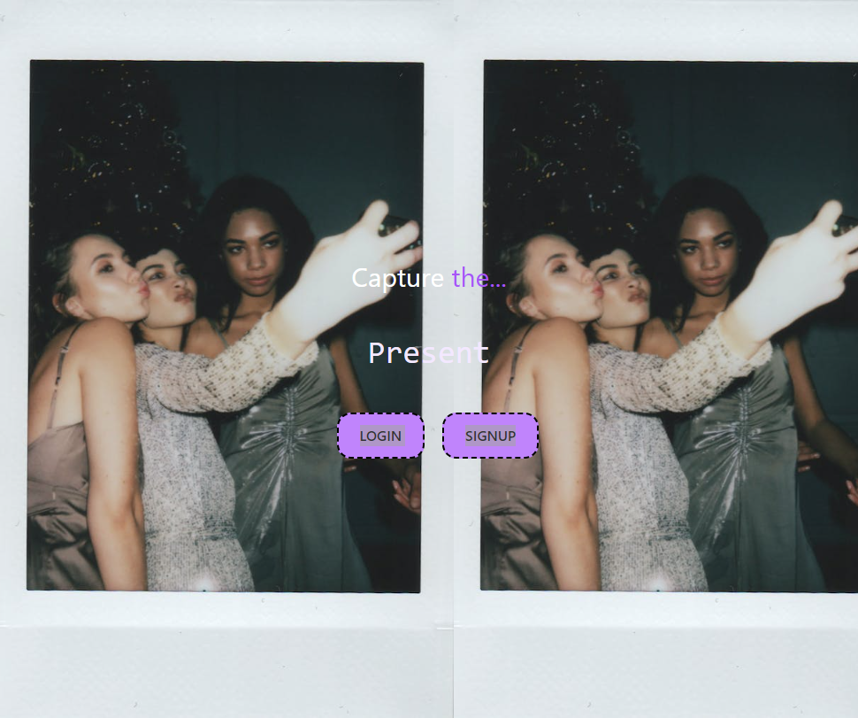

# Present

## A Photo Centric Social Media Application

### Overview

Capture The ... Present. Present is a photo centric social media application optimized for mobile devices that allows users to post photos once daily to share where they are or what they are currently doing in the present moment. To avoid stale content, Users feeds are only able to publicly display the posts of the last 7 days. All posts older than 7 days will be hidden from the feed in the user's personal scrapbook. Users are also able to leave comments and likes on other users' posts.

### Table Of Contents

1. [Acceptance Criteria](#acceptance-criteria)
2. [Work Completed](#work-completed)
3. [Future Developments](#future-developments)
4. [Deployed Application URL](#deployed-application-url)
5. [Deployed Application Screenshots](#deployed-application-screenshots)
6. [Credits](#credits)

### Acceptance Criteria

- GIVEN that I want to use a interactive social media app to share my photos instead of Instagram, Snapchat, or Facebook, WHEN I open the app, THEN I am presented with a sign up or login page;
- WHEN I sign up for the app, THEN I am prompted to create a username and password and enter my email address;
- WHEN I sign in to the app, THEN I am presented with the main feed page with the last 7 days of posts;
- WHEN I click on the comment icon, THEN I am presented with a text box where I can enter my comment;
- WHEN I click on the like icon, THEN I am presented with a icon that shows that I like the post;

### Work Completed

- User is able to sign up and login to the application into their own profile/account
- User is able to post photos to the application
- User is able to view all posts from the last 7 days
- User is able to view all posts from the last 7 days in their personal scrapbook
- User is able to leave comments on other users' posts
- User is able to like other users' posts with icons

### Future Developments

- Ability to share to Instagram/Facebook directly
- Ability to filter and remove offensive posts; add a content filter
- Ability to purchase a curated scrapbook/photo album of all your posts
- Month or Year end recap
- Reward system/badges that can be displayed, similar to Snap-streaks on Snapchat
- Ability to post GIFs
- Separate public feed and personal/friends only feed
- Prompt users to take photos in that exact moment, similar to BeReal
- Ability to capture photos with in-application camera function
- Alert users of likes, comments, etc. with live notifications
- Allow users to upload short videos

### Deployed Application URL

[Present App Login/Sign-Up Page](https://present-social-app-4b519de33a7f.herokuapp.com/)

### Deployed Application Screenshots

### Credits

Created by:

- [Colton Firestone](https://github.com/ColtonMakesStuff)
- [Omar Razo](https://github.com/Omar-Razo)
- [Taylor Rozier](https://github.com/RozierT)
- [Hamza Lhamous](https://github.com/musicchef)
- [Sier Behashti](https://github.com/Sbehashti)

Starter Code Provided by University of California, Davis Coding Bootcamp

#### Technologies Used

- React
- MongoDB
- Mongoose
- Express
- JavaScript
- Visual Studio Code
- GitHub
- Git
- Heroku
- Material UI
- Tailwind
